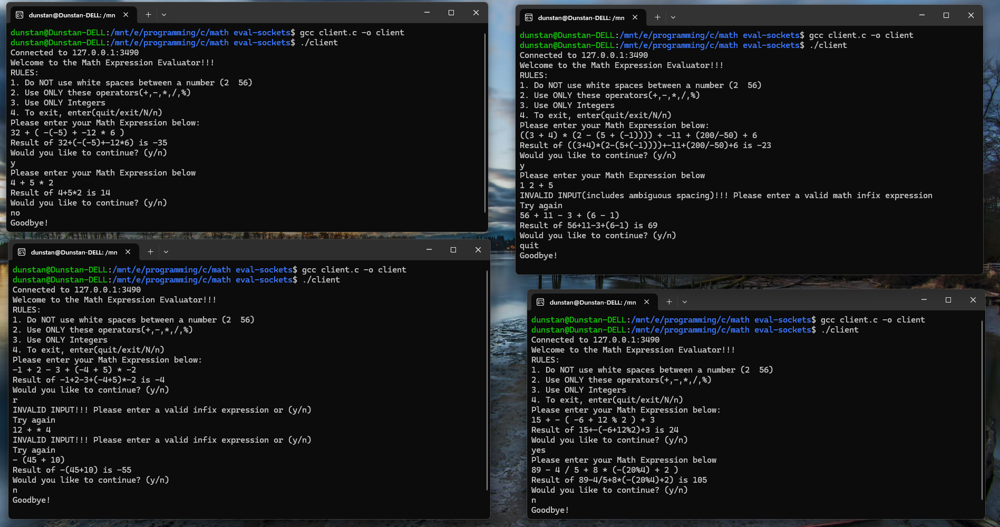
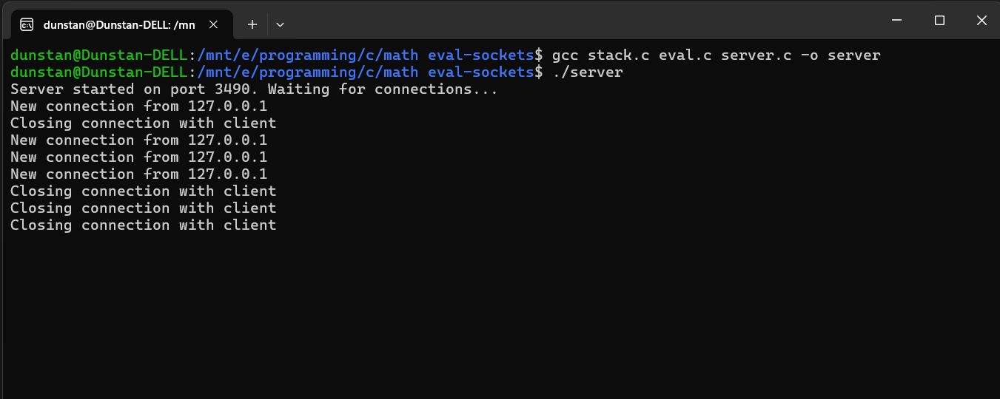

# Math Expression Evaluator (Client-Server using epoll)

A client-server system built in C for evaluating mathematical infix expressions using the **two-stack algorithm**. It uses **epoll** for concurrent client handling and supports **negative numbers**, **unary minus**, and **parentheses**.

---

## 📁 File Structure

```
math-eval-epoll/
├── client.c          // Connects to the server and sends expressions
├── server.c          // Handles multiple clients using epoll, processes expressions
├── eval.c            // Validates and evaluates infix expressions
├── eval.h            // Declarations for eval.c functions
├── stack.c           // Generic stack implementation using arrays
├── stack.h           // Header for stack operations
└── README.md         // Project documentation
```

---

## 🚀 Usage

### 1. Compile the project

```bash
gcc stack.c eval.c server.c -o server

gcc client.c -o client
```

### 2. Run the server

```bash
./server
```

### 3. Run the client (in a separate terminal)

```bash
./client
```

---

## 🔧 Workflow

### Client Side
1. Connects to server using TCP.
2. Displays welcome message and rules.
3. Sends expressions and receives evaluated results.
4. Supports quitting with inputs like `exit`, `n`, or `No`.

### Server Side
1. Accepts new connections using `epoll` (non-blocking I/O).
2. Sends rules and prompt to each new client.
3. For each expression received:
   - Checks for **ambiguous spacing** (e.g., `34  5`).
   - Validates the input as a correct **infix expression**.
   - Evaluates using the **two-stack algorithm**.
   - Sends the result or an appropriate error.
4. Gracefully closes connection if the client chooses to quit.

---

## 🔍 Evaluation Logic

- Uses a **two-stack approach**:
  - One stack for operands (integers).
  - One stack for operators (`+`, `-`, `*`, `/`, `%`, `(`, `)`).
- Supports **unary minus**, including:
  - Negative numbers like `-5`
  - Nested negations like `-(-(5))`
- Handles operator precedence and parenthesis evaluation.

---

## 📚 Concepts Demonstrated

- **C Socket Programming (TCP)**
- **epoll** for efficient I/O multiplexing
- **Dynamic, generic stack implementation**
- **Mathematical expression parsing and evaluation**
- **Unary operator handling in infix expressions**

---

## 📜 Example Expressions

| Expression                    | Result |
|------------------------------|--------|
| `23 + 4 - 12 * (4 * 6)`       | `-261` |
| `34 + 56 - 7 + -(11 * -2)`    | `98`   |
| `32 + (-(-5) + -12 * 6)`      | `-35`  |
| `-5 * (2 + 3)`                | `-25`  |

---

## 🛡️ Input Validation

- ❌ `23  45` → Rejected due to **ambiguous spacing**
- ❌ `5 + * 4` → Rejected due to **invalid infix**
- ✅ `-5 + (3 * 2)` → Valid expression

---

## 💻 Screenshots




---

## 📌 Notes
- Works on Linux natively.
- Windows users can run it via **WSL (Windows Subsystem for Linux)**.

---

## 🔗 References
- [Beej's Guide to Network Programming](https://beej.us/guide/bgnet/)
- [Linux epoll man page](https://man7.org/linux/man-pages/man7/epoll.7.html)
- *The Linux Programming Interface* by Michael Kerrisk

---

## 📄 License

This project is licensed under the [MIT License](https://opensource.org/licenses/MIT).
---
